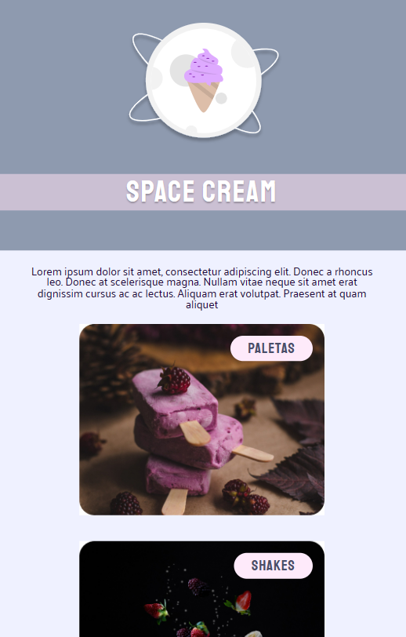
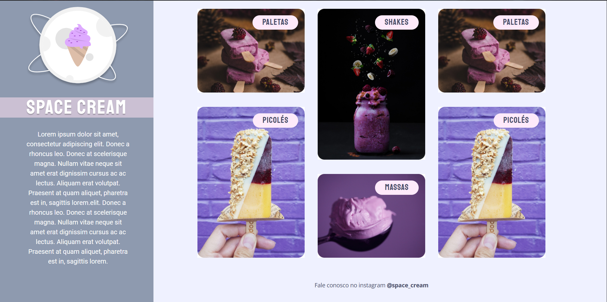

<h1 align="center"> Stage 03 Explorer - Space Cream </h1>

  

 

  
  

 

## 🚀 Tecnologias

Esse projeto foi desenvolvido com as seguintes tecnologias:

- HTML 
- CSS
- Figma

 

## 💻 Projeto

- [Visite o projeto online](https://breseiichi.github.io/projeto-spacecream/)
 

## 🔖 Layout

Você pode visualizar o layout do projeto através [DESSE LINK](https://www.figma.com/file/uYxAxfqEzRqiodEWf0LZcj/Stage-03---Grid-com-anima%C3%A7%C3%B5es-(Copy)?node-id=0%3A1&t=CYiCtmT8APFaEsyI-0). É necessário ter conta no [Figma](https://figma.com) para acessá-lo.

## :memo: Licença

Esse projeto está sob a licença MIT.

---

Projeto feito através do Programa Explorer da Rocketseat ♥